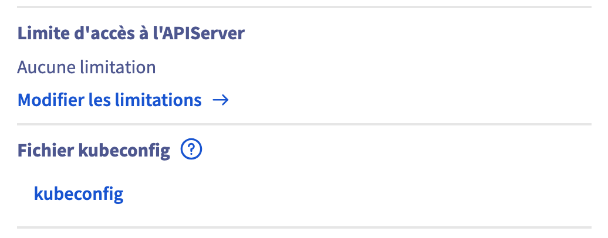

# Deploying a Helm Chart on Kubernetes

This documentation explains how to deploy a Helm chart on your Kubernetes cluster using your downloaded `KUBECONFIG` file. Follow these steps to set up your environment and deploy your application.

## 1. Download Your KUBECONFIG

- Log in to your cloud dashboard.
- Download your `KUBECONFIG` file.
- This file contains the necessary credentials and configuration to connect to your Kubernetes cluster.



## 2. Install kubectl

You can install `kubectl` using one of the following methods depending on your operating system.

### 2.1. Installation via Direct Download (macOS)

1. **Download the kubectl binary:**

```bash
curl -LO https://dl.k8s.io/release/$(curl -Ls https://dl.k8s.io/release/stable.txt)/bin/darwin/amd64/kubectl
```

2. **Make the binary executable:**

```bash
chmod +x ./kubectl
```
 
3. **Move the binary to your PATH:**

```bash
sudo mv ./kubectl /usr/local/bin/kubectl
```

### 2.2. Installation via Homebrew (macOS)

If you use Homebrew, you can install kubectl with:

```bash
brew install kubectl
```

Link:
[Documentation to install kubectl](https://kubernetes.io/fr/docs/tasks/tools/install-kubectl/)

### 3. Verify kubectl Installation

Test that the kubectl command line interface is working correctly:

```bash
kubectl version --client
```
 
### 4. Set Up Your kubeconfig

The default path for the kubectl configuration file is `~/.kube/config`.
 
### 5. Create the .kube directory

```bash
mkdir .kube
```
 
### 6. Move the configuration there

```bash
mv kubeconfig.yml .kube/config
or
mv kubeconfig .kube/config
```

### 7. View Your Kubeconfig Settings `KUBCONFIG`

```bash
kubectl config view
```
 
### 8. Test Kubernetes Cluster Connectivity

```bash
kubectl get nodes
```
{
⚠️⚠️⚠️
### Si vous avez des erreurs il peut s'agir que vous etes deja connecter a un cluster 

#### view all context created

```bash
kubectl config get-contexts
```
#### add your context

```bash
kubectl config set-context <current-context> --cluster=<cluster-name> --user=<user-name>
```
#### add url credential

```bash
kubectl config set-cluster lago --server=<https://...> --certificate-authority=</path/to/ca.crt>
```

#### add client certificat

Embed client certificate data in the "cluster-admin" entry kubectl config set-credentials cluster-admin

--client-key='': Path to client-key file for the user entry in kubeconfig

```bash
kubectl config set-credentials kubernetes-admin-lago --client-certificate=<~/.kube/admin.crt> --client-key=''
```

#### update context

```bash
kubectl config set-context kubernetes-admin@lago --cluster=<cluster-name> --user=<user-name>
```

#### verify 

```bash
kubectl config view --minify
```
#### swith context

```bash
kubectl config use-context <current-context> 
```
#### Now get your nodes

```bash
kubectl get nodes
```
⚠️⚠️⚠️
}

### 9. Deploy Your Helm Chart

Helm is used to manage Kubernetes applications. To install Helm, follow the instructions in the link:

[Documentation to install helm](https://helm.sh/fr/docs/intro/install/)

### 10. Install chart

Replace `my-release` with the name you want to assign to your deployment and `./path/to/my-chart` with the path to your Helm chart directory.

```bash
helm install mon-release ./path/to/my-chart
```

- **upgrade chart**

To upgrade your deployment with changes from the chart, use:

```bash
helm upgrade mon-release ./path/to/my-chart
```

#### 11. Monitor Your Deployment

```bash
kubectl get all
```